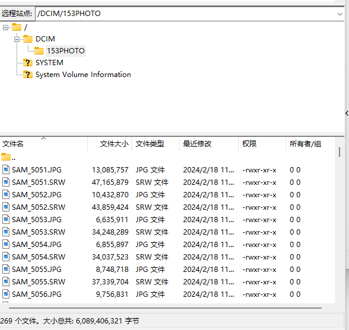

# 三星NX500文件/图片传输补丁

### 声明

本补丁程序基于 [nx500_nx1_modding](https://github.com/ottokiksmaler/nx500_nx1_modding)

感谢大佬在三星相机功能性可玩性上的探索。

本仓库提供了一个解决方案，弥补了三星 NX500 相机图传缺失的问题。其原理是通过替换 /usr/bin 内的蓝牙可执行文件，从而在打开蓝牙时同时执行打开 FTP 服务器的功能。

利用这一机制，用户可以通过 FTP 客户端连接到相机，实现图片文件的便捷传输。这种方法不仅弥补了图传 App 的缺失，还间接实现了边拍边传的功能，提升了相机使用体验。

通过采用这种补偿方案，NX500 用户可以解决图传问题。（三星相机增值服务）

**警告：该脚本将会更改相机原有的文件系统！！！**

**警告：该脚本将会更改相机原有的文件系统！！！**

**警告：该脚本将会更改相机原有的文件系统！！！**

如有恢复需求，请查阅[(Running_scripts_without_factory_mode_BT.md)](https://github.com/ottokiksmaler/nx500_nx1_modding/blob/master/Running_scripts_without_factory_mode_BT.md)

### 安装说明

1，安装脚本前，请重置相机蓝牙（取消相机与任何其他设备的配对），以及在关机前确认蓝牙开关处于关闭状态(**需要确保相机的蓝牙功能不会开机自启**)

2，将该项目的sdcard目录文件复制进SD卡**根目录**下（此时SD卡的目录结构应大致如下）

3，将SD卡放入相机，然后启动相机

安装脚本将会在相机开机后自动执行。

大约在30s内，安装脚本将会执行结束，安装进程结束后相机将会自动重启，检查SD卡内，info.tg和nx_cs.adj会被删除，若SD卡内已经不存在这两个文件，则安装脚本在逻辑上成功执行了。

### 使用说明

在脚本安装后，每次连接相机FTP传输图片需要遵循以下步骤：

1，连接wifi或使用手机作为热点，总之使相机与传输设备位于同一局域网下。

2，**确认相机连上wifi或热点后**，打开相机的蓝牙开关（蓝牙绑定了FTP服务）

2，查询相机的内网ip

3，使用FTP客户端工具（如filezillia（桌面端），FTP Rush（安卓），aFTP（安卓）等）软件通过内网ip连接相机。（默认不需要用户名与密码。如果需要输入用户名，可键入root）

4，Enjoy！

### Tips

1，相机的蓝牙开关绑定了FTP服务的开启，但并不意味着关闭蓝牙同时会关闭FTP服务，若有省电的顾虑，请使用完图传功能后采取关机操作以关闭FTP服务和屏幕（开机时FTP服务不会自动启动，需要手动打开蓝牙才会启动）

2，安装脚本后，需要确保蓝牙功能不会开机自启，请取消相机与任何其他设备的配对，以及在关机前确认蓝牙开关处于关闭状态。以上两种情况都会导致相机蓝牙开机自动启动影响相机图传补丁正常工作
